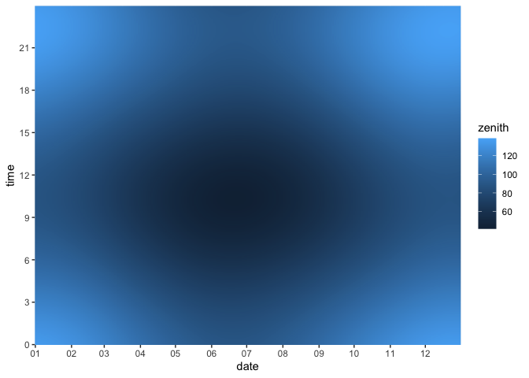
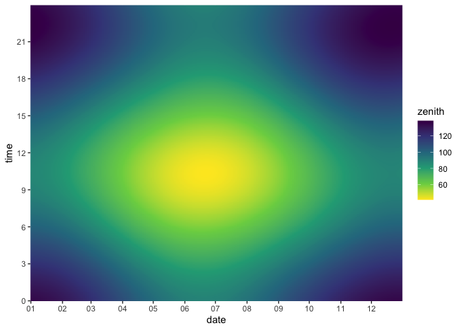
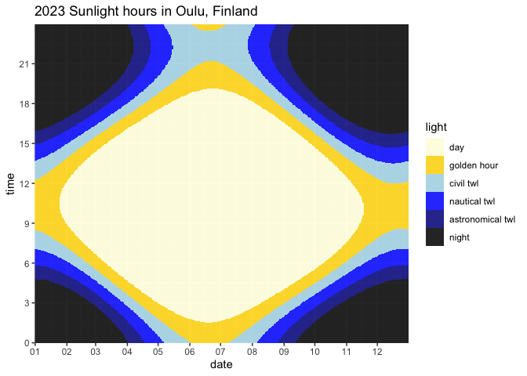

A temporal raster plot (carpet diagram) of annual sunlight based on
solarpos data
================

First, run [solarpos](https://github.com/klausbrunner/solarpos) and
capture its output in a CSV file. We’re getting position data for the
entire year 2023 in Oulu, Finland. Depending on your setup, you may have
to add the “java” command and an absolute path.

``` zsh
solarpos 65.013 25.473 2023 --timezone UTC --deltat --format=csv --headers position --step=180 > /tmp/sunpositions.csv
```

Now read that CSV file, dropping what we don’t need and regrouping the
data a bit for convenient plotting.

``` r
library(tidyverse)
library(lubridate, warn.conflicts = FALSE)

sunpath <- read_csv(
  "/tmp/sunpositions.csv",
  show_col_types = FALSE
) |>
  mutate(
    date = date(dateTime),
    time = hour(dateTime) + minute(dateTime) / 60,
    azimuth = NULL,
    daytime = NULL
  )

sunpath
```

    ## # A tibble: 175,200 × 4
    ##    dateTime            zenith date        time
    ##    <dttm>               <dbl> <date>     <dbl>
    ##  1 2023-01-01 00:00:00   135. 2023-01-01  0   
    ##  2 2023-01-01 00:03:00   135. 2023-01-01  0.05
    ##  3 2023-01-01 00:06:00   135. 2023-01-01  0.1 
    ##  4 2023-01-01 00:09:00   135. 2023-01-01  0.15
    ##  5 2023-01-01 00:12:00   134. 2023-01-01  0.2 
    ##  6 2023-01-01 00:15:00   134. 2023-01-01  0.25
    ##  7 2023-01-01 00:18:00   134. 2023-01-01  0.3 
    ##  8 2023-01-01 00:21:00   134. 2023-01-01  0.35
    ##  9 2023-01-01 00:24:00   134. 2023-01-01  0.4 
    ## 10 2023-01-01 00:27:00   133. 2023-01-01  0.45
    ## # … with 175,190 more rows

With the nicely prepared data, plotting should be straightforward now.
Getting the axes and labelling right is a bit of a hassle, though.

``` r
library(scales, warn.conflicts = FALSE)

plot <- ggplot(sunpath, aes(date, time)) +
  geom_raster(aes(fill = zenith)) +
  scale_y_continuous(expand = c(0, 0), breaks = seq(0, 24, 3)) +
  scale_x_date(
    labels = date_format("%m"),
    breaks = breaks_width("month"),
    expand = c(0, 0)
  )

plot
```

<!-- -->

It’s a start, but the default colour palette clearly isn’t a good
choice.

``` r
plot <- plot + scale_fill_continuous(type = "viridis", direction = -1)

plot
```

<!-- -->

Aesthetically better, but still hard to make sense of. It really seems
we need a custom colour scheme with irregular breaks, and I haven’t had
much luck defining those in R. To make this easier and explicit rather
than relying on ggplot’s colour mapping magic, let’s change the data
from continuous to categorical first, and use a manual colour mapping.

``` r
sunpath <- sunpath |>
  mutate(light = cut(
    zenith,
    labels = c(
      "day",
      "golden hour",
      "civil twl",
      "nautical twl",
      "astronomical twl",
      "night"
    ),
    breaks = c(0, 84, 90, 96, 102, 108, 180)
  ))

sunpath
```

    ## # A tibble: 175,200 × 5
    ##    dateTime            zenith date        time light
    ##    <dttm>               <dbl> <date>     <dbl> <fct>
    ##  1 2023-01-01 00:00:00   135. 2023-01-01  0    night
    ##  2 2023-01-01 00:03:00   135. 2023-01-01  0.05 night
    ##  3 2023-01-01 00:06:00   135. 2023-01-01  0.1  night
    ##  4 2023-01-01 00:09:00   135. 2023-01-01  0.15 night
    ##  5 2023-01-01 00:12:00   134. 2023-01-01  0.2  night
    ##  6 2023-01-01 00:15:00   134. 2023-01-01  0.25 night
    ##  7 2023-01-01 00:18:00   134. 2023-01-01  0.3  night
    ##  8 2023-01-01 00:21:00   134. 2023-01-01  0.35 night
    ##  9 2023-01-01 00:24:00   134. 2023-01-01  0.4  night
    ## 10 2023-01-01 00:27:00   133. 2023-01-01  0.45 night
    ## # … with 175,190 more rows

``` r
plot <- ggplot(sunpath, aes(date, time)) +
  geom_raster(aes(fill = light), alpha = 0.85) +
  scale_y_continuous(expand = c(0, 0), breaks = seq(0, 24, 3)) +
  labs(title = "2023 Sunlight hours in Oulu, Finland") +
  scale_x_date(
    labels = date_format("%m"),
    breaks = breaks_width("month"),
    expand = c(0, 0)
  ) +
  scale_fill_manual(
    values = c(
      "day" = "lightyellow",
      "golden hour" = "gold",
      "civil twl" = "lightblue",
      "nautical twl" = "blue",
      "astronomical twl" = "blue4",
      "night" = "black"
    )
  )

plot
```

<!-- -->

Doesn’t have the same mysterious vibe as the previous ones, but it’s a
bit more useful now: we can clearly see those very long Northern summer
days and depressingly long winter nights, peaking on 21 June and 21
December, respectively. Of course, don’t forget all times are UTC. You
can also tell solarpos-cli to use the proper local timezone
(Europe/Helsinki).

Next up: smoothing the contours…
