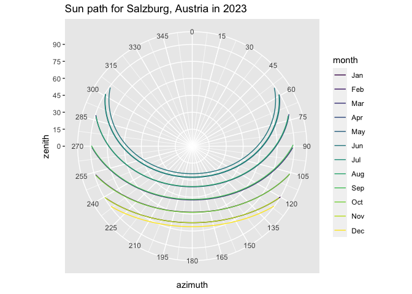
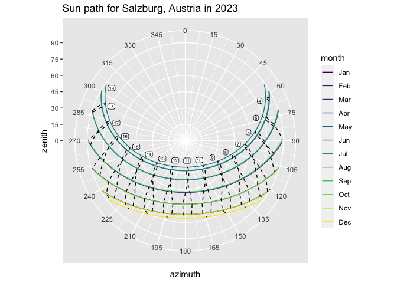

Plotting a sun-path diagram in R using data from solarpos-cli
================

First, run [solarpos-cli](https://github.com/KlausBrunner/solarpos-cli)
and capture its output in a CSV file. We’re getting position data for
the entire year 2023 in Salzburg, Austria. Depending on your setup, you
may have to add the “java” command and an absolute path.

``` sh
solarpos-cli.jar 47.795 13.047 2023 --timezone UTC --deltat --format=csv position --step=600 > /tmp/sunpositions.csv
```

Now read that CSV and pick data for one day of each month. While we’re
at it, remove all observations where the sun isn’t visible anyway
(i.e. zenith angle is greater than 90°) and add a convenient “month”
column. This will come in handy for the diagram.

``` r
library(tidyverse)
library(lubridate, warn.conflicts = FALSE)
```

    ## Loading required package: timechange

``` r
sunpath <- read_csv("/tmp/sunpositions.csv", 
                    col_names=c("daytime", "azimuth", "zenith"), 
                    show_col_types = FALSE) |> 
  filter(day(daytime) == 21) |> 
  filter(zenith <= 90.0) |>
  mutate(month = month(daytime, label=TRUE))

sunpath
```

    ## # A tibble: 875 × 4
    ##    daytime             azimuth zenith month
    ##    <dttm>                <dbl>  <dbl> <ord>
    ##  1 2023-01-21 06:50:00    120.   89.9 Jan  
    ##  2 2023-01-21 07:00:00    122.   88.7 Jan  
    ##  3 2023-01-21 07:10:00    124.   87.4 Jan  
    ##  4 2023-01-21 07:20:00    126.   86.0 Jan  
    ##  5 2023-01-21 07:30:00    127.   84.7 Jan  
    ##  6 2023-01-21 07:40:00    129.   83.4 Jan  
    ##  7 2023-01-21 07:50:00    131.   82.2 Jan  
    ##  8 2023-01-21 08:00:00    133.   81.0 Jan  
    ##  9 2023-01-21 08:10:00    135.   79.8 Jan  
    ## 10 2023-01-21 08:20:00    138.   78.6 Jan  
    ## # … with 865 more rows

Now plot a simple sun path diagram.

``` r
plot <- ggplot() + 
  geom_line(data = sunpath, aes(x = azimuth, y = zenith, group = month, colour = month)) + 
  scale_y_continuous(limits = c(0, 90), breaks = seq(0, 90, by=15)) + 
  scale_x_continuous(limits = c(0, 360), breaks = seq(0, 359, by=15)) +
  labs(title = "Sun path for Salzburg, Austria in 2023") +
  coord_polar()

plot
```

<!-- -->

Let’s see if we can add the analemma lines for each hour as well.

``` r
hours <- sunpath |>
  filter(minute(daytime) == 0, second(daytime) == 0) |>
  mutate(hour = hour(daytime))

plot <- plot + 
  geom_path(data = hours, aes(x = azimuth, y = zenith, group = hour), linetype = "dashed")

plot
```

<!-- -->

Let’s see if we can add labels to those. This requires a bit of manual
adjustment.

``` r
hour_ends <- hours |> filter(month == "Jun")

plot <- plot +
  geom_label(data = hour_ends, nudge_y = -6, label.padding = unit(0.1, "lines"), size = 2, aes(x = azimuth, y = zenith, label = hour))

plot
```

<!-- -->
